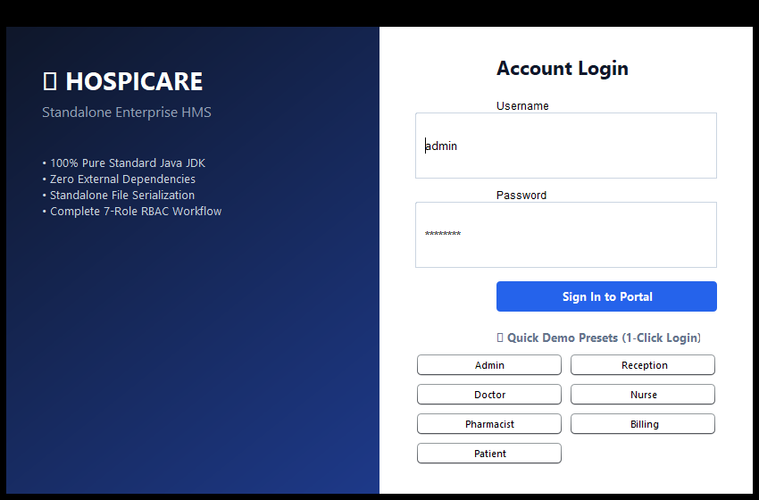
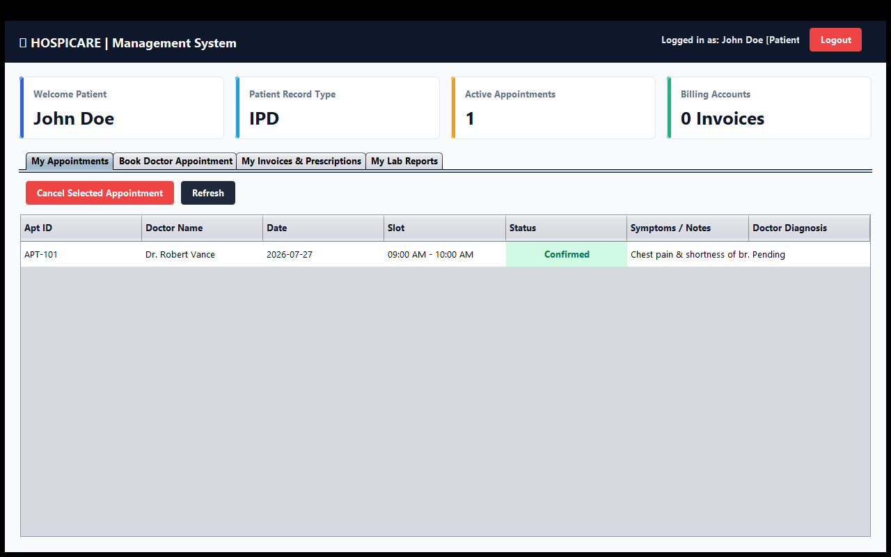

# Hospital Management System

A comprehensive, role-based desktop application built in Java using the Swing UI toolkit. This system is designed to streamline hospital operations by providing dedicated interfaces and functionalities for various hospital staff and patients.

## Features

- **Role-Based Access Control (RBAC):** Tailored dashboards and permissions for 7 distinct user roles.
- **Appointment Management:** Schedule, confirm, request, and complete patient appointments.
- **Bed & Ward Allocation:** Manage ICU, General, and Private wards with live occupancy tracking.
- **Pharmacy & Inventory:** Keep track of medicines, stock levels, and issue prescriptions.
- **Billing & Invoices:** Generate detailed invoices for appointments, bed stays, and pharmacy items.
- **Patient Vitals Tracking:** Nurses can record and monitor patient vitals over time.
- **System Audit Logs:** Automatically logs critical actions for system security and auditability.
- **Local Data Storage:** Uses Java object serialization (`.dat` files) for a lightweight, dependency-free database experience.

## Supported Roles

Upon startup, the system seeds a default database. You can log in using the following roles (Default Password for all seeded users is usually `[role]123`, e.g., `admin123` for Admin):

- **Admin** (`admin`) - Full access to all panels and system logs.
- **Receptionist** (`reception`) - Manage appointments and basic patient registrations.
- **Doctor** (`doctor`, `dr_smith`, `dr_patel`) - Manage own appointments, patients, and issue prescriptions.
- **Nurse** (`nurse`) - Record patient vitals and manage ward bed allocations.
- **Pharmacist** (`pharma`) - Manage medicine inventory and view patient prescriptions.
- **Billing Staff** (`billing`) - Manage invoices and payment statuses.
- **Patient** (`patient`, `patient2`, `patient3`) - Request appointments and view personal history/invoices.

## Screenshots

###### Login Screen


###### Patient Dashboard


## Installation & Running

This project does not require an external database server (like MySQL), as it leverages local serialized `.dat` files stored in the `data/` directory.

### Using an IDE (Recommended)
1. Clone the repository to your local machine.
2. Open the project in IntelliJ IDEA, Eclipse, or your preferred Java IDE.
3. Mark the `src` folder as the Sources Root.
4. Run the `Main.java` file located at `src/com/hospital/Main.java`.

### Using Command Line
Navigate to the root directory of the project and compile the source code:
```bash
# Windows
javac -d bin -sourcepath src src\com\hospital\Main.java

# Run the application
java -cp bin com.hospital.Main
```

## Data Storage

All data is automatically serialized and saved to `.dat` files within the `data/` directory upon application exit. To reset the database to its default seeded state, simply delete the `data/` directory and restart the application.

## License

This project is open-sourced software licensed under the [MIT license](https://opensource.org/licenses/MIT).
